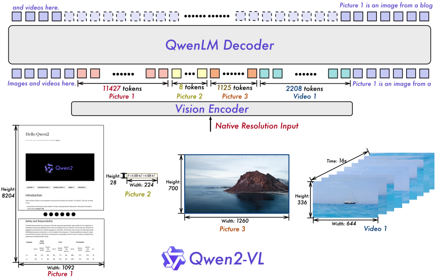
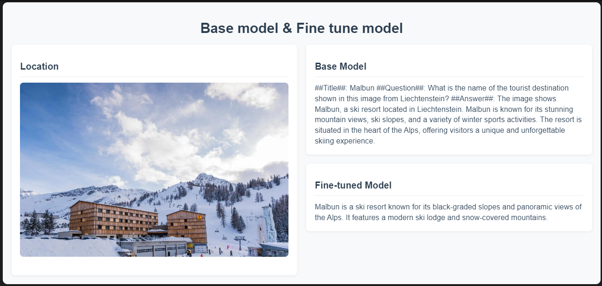
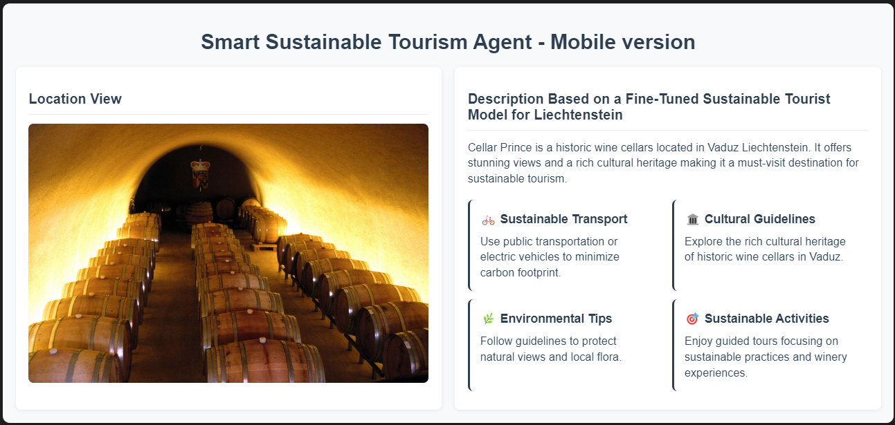

# TRL-Optimized Vision-Language Model for Sustainable Tourism Agents

This repository contains the implementation of a fine-tuned Vision Language Model (VLM) optimized for sustainable tourism in Liechtenstein using Transformer Reinforcement Learning (TRL) and Smolagent library integration.

## Table of Contents
- [Overview](#overview)
- [Repository Structure](#repository-structure)
- [Model Architecture](#model-architecture)
- [Dataset](#dataset)
- [Fine-tuning Process](#fine-tuning-process)
- [Evaluation Results](#evaluation-results)
- [Example Outputs](#example-outputs)
- [Resources](#resources)
- [Credits](#credits)
- [Acknowledgments](#acknowledgments)
- [Contact](#contact)

## Overview

This research presents a novel approach to sustainable tourism guidance by fine-tuning the Qwen2-VL-2B-Instruct model using TRL methods. The project combines advanced vision-language modeling with sustainable tourism expertise to create an intelligent system capable of generating contextually relevant and environmentally conscious tourism recommendations for Liechtenstein's attractions.

## Repository Structure

The repository contains two main Jupyter notebooks:
1. TRL Fine-tuning Notebook: Implements the fine-tuning process using TRL, comparison between base and fine-tuned models and agent part.
2. Evaluation Notebook: Contains evaluation metrics.

## Model Architecture

- Base Model: [Qwen2-VL-2B-Instruct](https://huggingface.co/Qwen/Qwen2-VL-2B-Instruct)
- Fine-tuned Model: [TRL-sustainable-tourist-FL-Evaluate](https://huggingface.co/arad1367/TRL-sustainable-tourist-FL-Evaluate)
- Training Method: Supervised Fine-tuning (SFT) with TRL
- Architecture: QLoRA-based configuration

The model architecture is illustrated below:

## Dataset

- Dataset: [Liechtenstein Tourist OCR Big Dataset](https://huggingface.co/datasets/arad1367/Liechtenstein_Tourist_OCR_Big_Dataset)
- Size: 2000+ images of Liechtenstein tourist attractions
- Format: Custom formatted for TRL training with system messages and specific prompts

## Fine-tuning Process

The model was fine-tuned using:
- TRL (Transformer Reinforcement Learning) framework
- QLoRA optimization
- Hardware: RTX 4080 GPU with 25GB RAM
- Training Steps: 180 steps with progressive loss reduction from 2.9896 to 0.0162

## Evaluation Results

Metrics progression over three epochs:
1. First Epoch:
  - BLEU: 0.0477
  - ROUGE-L F1: 0.1797
  - METEOR: 0.3768

2. Second Epoch:
  - BLEU: 0.1495
  - ROUGE-L F1: 0.3251
  - METEOR: 0.6228

3. Third Epoch:
  - BLEU: 0.1552
  - ROUGE-L F1: 0.3268
  - METEOR: 0.6246

## Example Outputs

The repository includes comparison outputs demonstrating the model's capabilities:

1. Base Model vs Fine-tuned Model Comparison:
  
  *Comparison between base and fine-tuned model outputs for Malbun ski resort*

2. SmoLAgent Implementation:
  
  *SmoLAgent implementation output for the Cellars of the Prince of Liechtenstein*

## Resources

- [TRL Library](https://github.com/huggingface/trl)
- [SmoLAgent Library](https://github.com/huggingface/smolagents)
- [Base Model](https://huggingface.co/Qwen/Qwen2-VL-2B-Instruct)
- [Fine-tuned Model](https://huggingface.co/arad1367/TRL-sustainable-tourist-FL-Evaluate)

## Credits

This implementation is based on Phil Schmid's work on multimodal LLM fine-tuning with TRL. The original code can be found here:
- [Original Implementation](https://github.com/philschmid/deep-learning-pytorch-huggingface/blob/main/training/fine-tune-multimodal-llms-with-trl.ipynb)

Our work extends this foundation with:
- Optimization for sustainable tourism tasks
- Integration of SmoLAgent
- Custom evaluation metrics
- Implementation of sustainable tourism agents

## Acknowledgments

Special thanks to:
- The University of Liechtenstein for providing the computational resources necessary for this research
- Phil Schmid for the original implementation that served as the foundation for this work

## Contact

For any questions or discussions about this research, please contact:
- Academic: pejman.ebrahimi@uni.li
- General: pejman.ebrahimi77@gmail.com